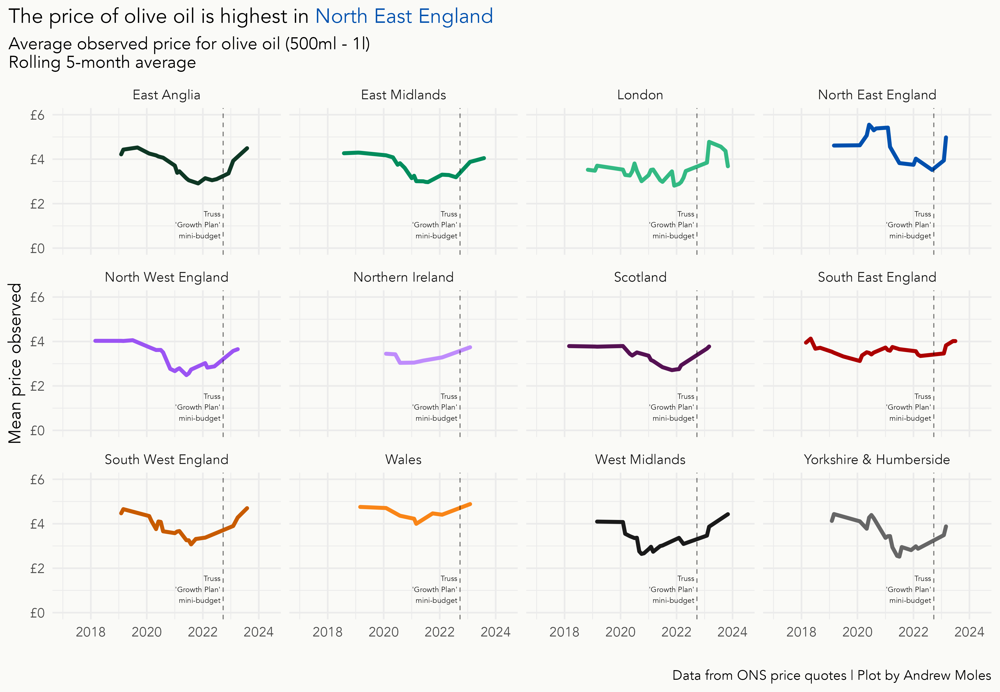

# ONS-Price-Quotes

## About this Dataset

This dataset is all about price quotes of consumable goods like food or alcohol. Extract from the ONS data store about what this dataset is:
> Price quote data and item indices that underpin consumer price inflation statistics are now published, giving users unprecedented access to the detailed data that are used in the construction of the UK's inflation figures. With effect from the January 2017 consumer price inflation publication, these data are published on a monthly basis showing the latest month.

This repository has scripts for automated pulling of this data up to December 2017. Prior to this the data was released yearly, starting in 2005; aim is to also make scripts and extracts which includes yearly data. 

The datasets are very large and for this reason only small extracts have been provided such as just olive oil prices. 

If you want to extract all the data, use the get_data.R script to pull the data. You might need to adjust the dates a little. It is currently extracting from Dec 2017 to Nov 2023. Then run the wrangle.R script to get data on fruit and vegetables, or alcohol and tobacco prices which have been prepared.

## General information and links

The code uses various libraries to extract and wrangle the data. The scripts primarily use tidyverse packages such as `dplyr` and `purrr`, and `data.table` due to the size of the datasets once extracted. 

data from: 

https://www.ons.gov.uk/economy/inflationandpriceindices/datasets/consumerpriceindicescpiandretailpricesindexrpiitemindicesandpricequotes

glossary for datasets can be found here:

https://www.ons.gov.uk/file?uri=%2feconomy%2finflationandpriceindices%2fdatasets%2fconsumerpriceindicescpiandretailpricesindexrpiitemindicesandpricequotes%2fglossary/glossaryrevised.xls

ideas from https://github.com/VictimOfMaths/Routine-Data/blob/master/ONSPriceQuotes.R 

## Example plots

